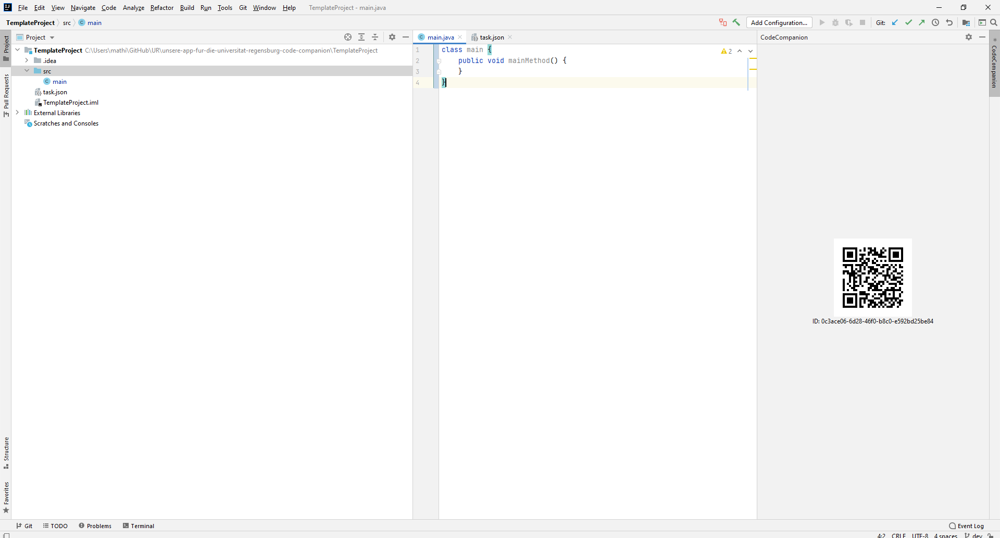
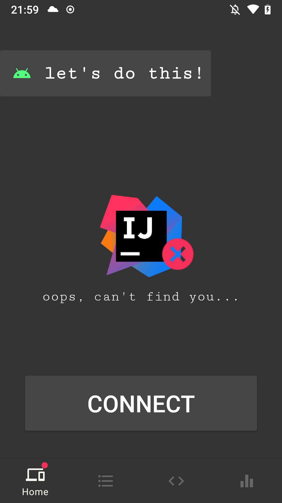
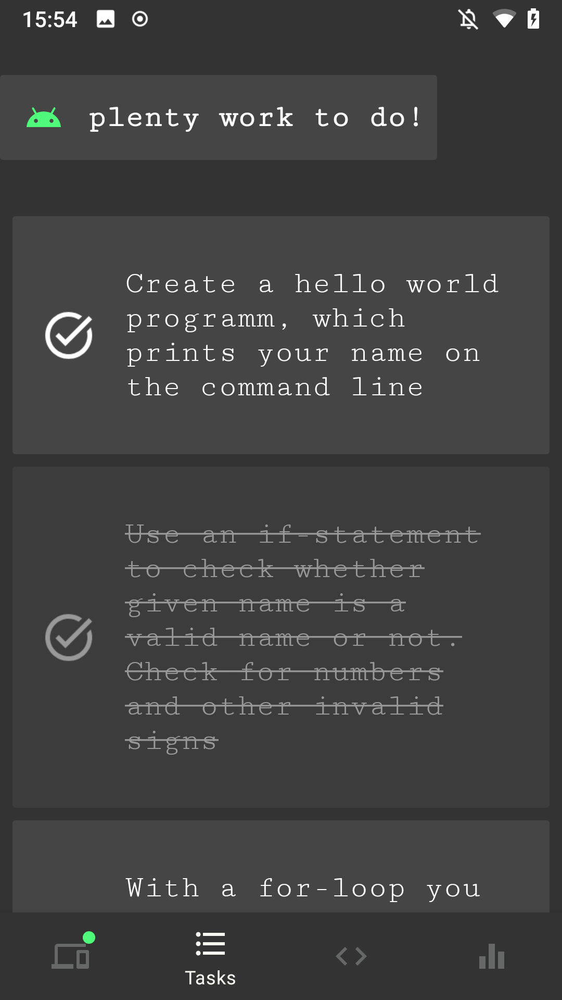
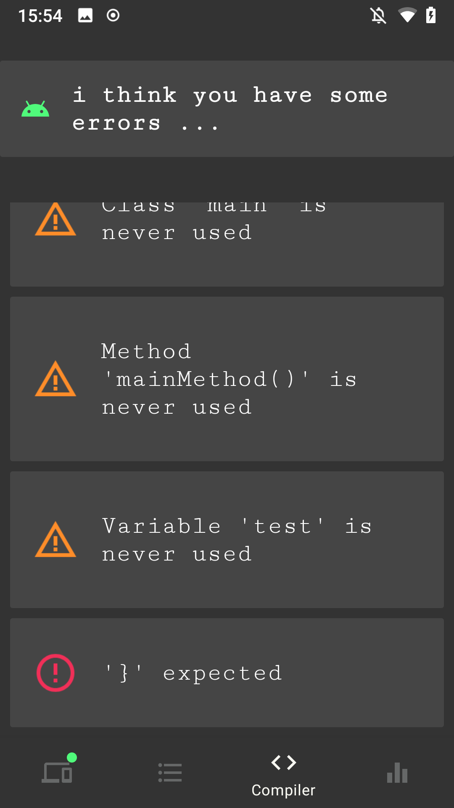
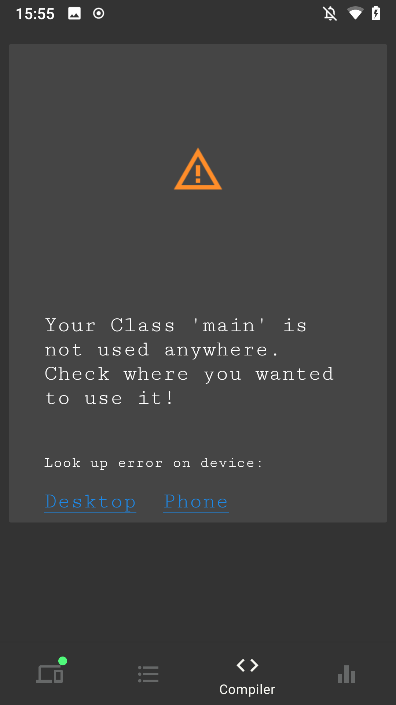
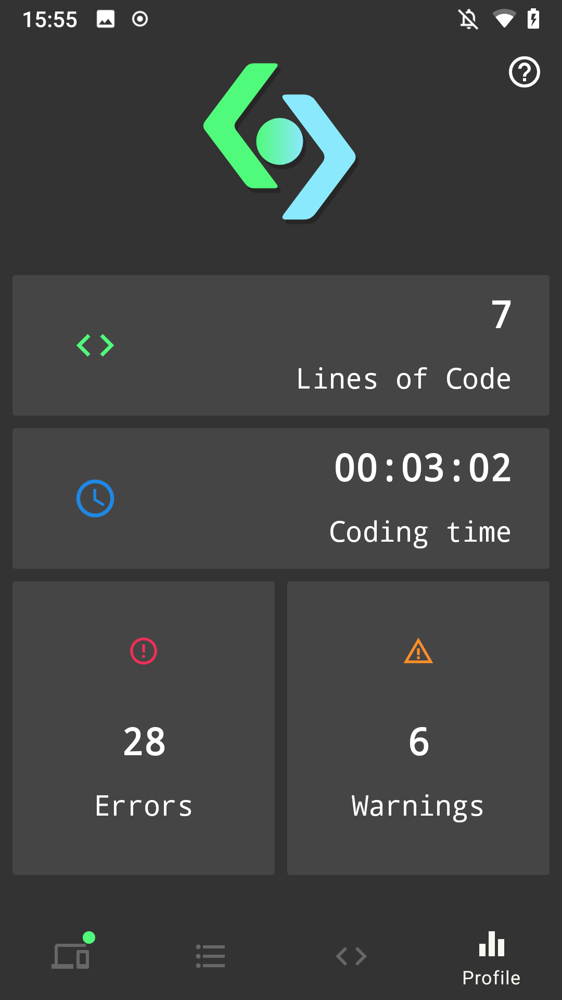

# Code Companion

## Concept
The Goal of the Project is to provide realtime coding assistance on a second screen to help beginners with their coding tasks.  
The Project consists of a Plugin for the Jetbrains IntelliJ Platform reporting to the connecting Android App using WebRTC.
This App shows the current tasks, compiler errors and coding statistics.  


## Requirements

* Android Phone running Android 6.0 (Marshmallow) or later
* IntelliJ IDEA Version 2020.3.3

### Compatibility
The plugin can be built and run for older / newer IntelliJ versions by adjusting the *version* number in [build.gradle.kts](./Plugin/build.gradle.kts) on Line 27.
Tested to run on Versions 2020.2.3, 2020.3.3 and 2021.1.

### Installation
To use the Project, the Android App and the Connection Plugin need to be installed. 
To install the Plugin, just follow the [link](https://plugins.jetbrains.com/plugin/16524-codecompanion) to the IntelliJ Marketplace or download it [directly](https://github.com/UniRegensburg/unsere-app-fur-die-universitat-regensburg-code-companion/releases/download/latest/CodeCompanion-Plugin.zip). 
To install the .zip-File, open IntelliJ and navigate to File -> Settings -> Plugins, select "Install from disk" under the settings gear icon (⚙) and follow the instructions to install your downloaded .zip file.  

To install the App, download the [APK File](https://github.com/UniRegensburg/unsere-app-fur-die-universitat-regensburg-code-companion/releases/download/latest/CodeCompanion-App.apk), and install it as described [here](https://www.lifewire.com/install-apk-on-android-4177185).  

A template project for testing can be found [here](https://github.com/UniRegensburg/unsere-app-fur-die-universitat-regensburg-code-companion/tree/main/TemplateProject).


* [Android App Google Play Store (coming soon)]()
* [Android App APK Download](https://github.com/UniRegensburg/unsere-app-fur-die-universitat-regensburg-code-companion/releases/download/latest/CodeCompanion-App.apk)
* [IntelliJ Plugin Download (Plugin Marketplace)](https://plugins.jetbrains.com/plugin/16524-codecompanion)
* [IntelliJ Plugin Download (.zip File)](https://github.com/UniRegensburg/unsere-app-fur-die-universitat-regensburg-code-companion/releases/download/latest/CodeCompanion-Plugin.zip)


### Connection

<table>
  <tr>
    <td><div style="width:400px; overflow:hidden"></div></td>
    <td>When installed, the Plugin adds a ToolWindow to the IDE showing a QR-Code containing connection information. This code has to be scanned inside the Android App to start the connection process.
        When the connection has been established correctly, The Plugin and App have indicators that change to green.</td>
  </tr>
    <tr>
    <td><div style="width:400px; overflow:hidden"></div></td>
    <td>The user can tap on the **connect** button in the home fragment to start the connection process. The app then asks the user for permission to access the device's camera and starts the QR-Code scanner if granted. Upon successfully scanning the QR-Code displayed in the Plugin, the connection will be established.</td>
  </tr>
  
</table><br>

### Tasks
<table>
  <tr>
    <td><div style="width:400px; overflow:hidden"></div></td>
    <td>The task view shows the individual tasks of the coding assignment. The tasks can be individually sorted and checked.</td>
  </tr>
</table><br>


#### Provide Task information
The "task.json" file is located inside the root of the project folder, and holds the project name, tasks and project due date.  
The given tasks show up in the task view of the app, and update in real-time.
The due date value is used to send a notification 1 week, 3 days and 1 day before the deadline reminding the user to finish the task.
The file needs at least informations on name and due-date and one or more tasks to work.
If the task.json is not present, the screen in the App will stay empty.

Example:
 
```
{
  "informations": {
    "name" : "Testaufgabe 1.0",
    "lecture" : "EIDI",
    "date" : "2021-01-15",
    "deadline" : "2021-03-15"
  },
  "tasks":[
    {
      "description": "Create a hello world programm, which prints your name on the command line"
    },
    {
      "description": "Use an if-loop to check whether given name is a valid name or not. Check for numbers and other invalid signs"
    },
    {
      "description": "With a for-loop you can iterate every element in an array. Iterate the given array 'names' and print out every name to the commandline"
    }
  ]
}
```

### Errors

<table>
  <tr>
    <td><div style="width:400px; overflow:hidden"></div></td>
    <td>The error view contains all compiler errors and warnings of the file currently being worked on, and is updated in real time.</td>
  </tr>
    <tr>
    <td><div style="width:400px; overflow:hidden"></div></td>
    <td>When clicked, a more detailed explaination on the error is shown, also offering the possibility of looking the problem up on google using the phone or desktop.</td>
  </tr>
</table><br>


### Statistics
<table>
  <tr>
    <td><div style="width:400px; overflow:hidden"></div></td>
    <td>The statistics view shows the time spent coding, produced lines of code and produced errors and warnings. If the App is connected, the values are project specific. If the app is disconnected, it shows overall statistics of all projects combined.</td>
  </tr>
</table><br>


## Team
Code Companion is developed by Fabian (@PLACEBOBRO), Lukas (@RealWhimsy), Mathias (@goetzmat) and Maximilian (@MaximilianSeewald) during the "Advanced Software Engineering" Course of Uni Regensburg.
