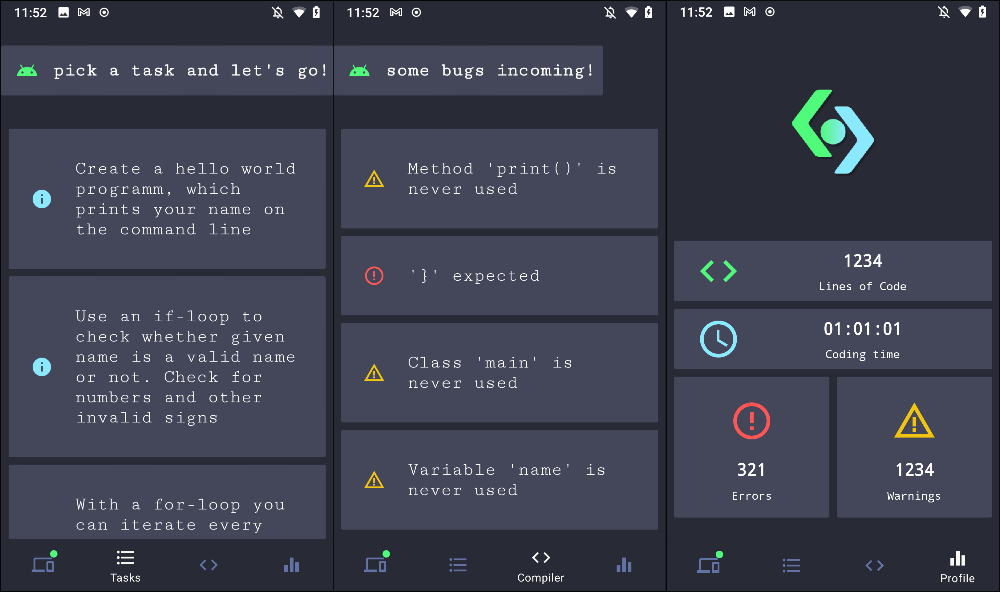

# Code Companion

## Concept
The Goal of the Project is to provide realtime coding assistance on a second screen to help beginners with their coding tasks.  
This is implemented using an Android App providing real time compiler errors, tasks and coding statistics as well as providing notifications for upcoming project deadlines.

## Implementation

The Project consists of a Plugin for the Jetbrains IntelliJ Platform (plugin marketplace link coming soon) reporting to the connecting Android App (google play link coming soon) using WebRTC.
This App shows the current tasks, compiler errors and coding statistics.  


  


## Team
Code Companion is developed by Fabian (@PLACEBOBRO) Lukas (@RealWhimsy) Mathias (@goetzmat) and Maximilian (@MaximilianSeewald) during the "Advanced Software Engineering" Course of Uni Regensburg.


## Template Project

A template project can be found -here-.

## Task Information

The "task.json" file is located inside the root of the project folder, and holds the project name, tasks and project due date.  
Example:
 
```
{
  "informations": {
    "name" : "Testaufgabe 1.0",
    "lecture" : "EIDI",
    "date" : "2021-01-15",
    "deadline" : "2021-03-15"
  },
  "tasks":[
    {
      "description": "Create a hello world programm, which prints your name on the command line"
    },
    {
      "description": "Use an if-loop to check whether given name is a valid name or not. Check for numbers and other invalid signs"
    },
    {
      "description": "With a for-loop you can iterate every element in an array. Iterate the given array 'names' and print out every name to the commandline"
    }
  ]
}
```